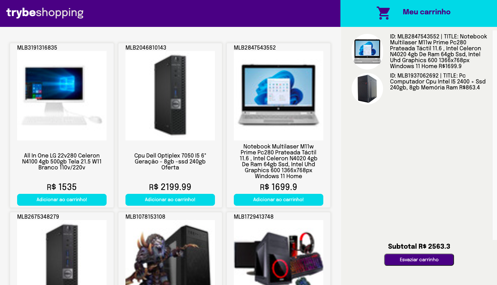

# Shopping Cart

Shopping Cart project is a fully dynamic shopping cart. For this, it will consume data directly from the Mercado Livre API. Besides, it is a test-oriented development project and is capable of:

- add and remove products from the shopping cart;
- empty the cart;
- when restarting the page, the products that were previously in the cart are still there;
- see the subtotal of the products that are in the cart;

<div align="center" display="inline">

</div>

## How to use:
- First clone the repository into your machine;

```
git clone git@github.com:GabiNamu/Shopping-Cart.git
```
- Go to the project directory;

```
cd Shopping-Cart
```

- Install dependencies;

```
npm install
```
- Start the server;
```
npm start
```
## Main technologies used:
- API request;
- JavaScript;
- Css;
